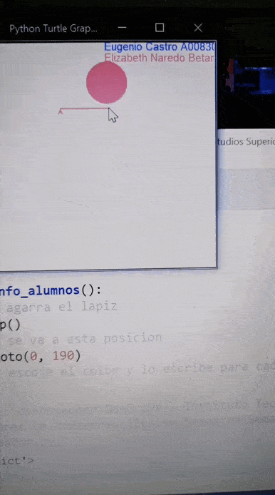

# SemanaTecCompu
Repositorio para mi clase de herramientas computacionales.

# Codigo hecho por Eugenio Castro

- nombres de los alumnos
```python
def info_alumnos():
    # agarra el lapiz
    up()
    # se va a esta posicion
    goto(0, 190)
    # escoje el color y lo escribe para cada almuno
    color('blue')
    write('Eugenio Castro A00830392', align='left', font=('Arial', 10, 'normal'))
    # nueva posicion para nuevo nombre
    goto(0, 170)
    color('pink')
    write('NOMBRE', align='left', font=('Arial', 10, 'normal'))
```
- circulo
```python
def circle2(start, end):
    "Draw circle from start to end."
    # sube el lapiz
    up()
    # mueve a al posicion x, y
    goto(start.x, start.y)
    d = end.x - start.x
    # baja el lapiz
    down()
    # empiza el llenado
    begin_fill()
    # se hace el circulo
    circle(d/2)
    end_fill()
```
    
- nuevo color
```python
# color rosa, P para pink
# color nuevo usando funcion lambda
onkey(lambda: color('#f633ff'), 'P')
```

# Codigo hecho por Alexia Naredo

- triángulo 
```python
def triangle(start, end):
    "Draw triangle from start to end."
    #levantamos lápiz
    up()
    #vamos a primera coordenada
    goto(start.x, start.y)
    #bajamos el lápiz para dibujar
    down()
    begin_fill()

    #por cada lado del triangulo 
    for count in range(3):
        #nos movemos la distancia entre la primera y segunda coordenada en x
        forward(end.x - start.x)
        #en un angulo de 120° hacia la izquierda, para terminar tener un triangulo con 3 ángulos de 60°
        left(120)

    #terminamos de dibujar
    end_fill()
```

- rectángulo 
```python
def rectangle(start, end):
    "Draw rectangle from start to end."
    #levantamos el lápiz
    up()
    #vamos a primera coordenada (esquina superior izquierda) 
    goto(start.x, start.y)
    #indicamos que nos dirigimos a la izquierda
    setheading(0)
    #bajamos el lapiz para empezar a dibujar
    down()
    begin_fill()
    #vamos a la esquina superior derecha
    goto(end.x, start.y)
    #giramos 90 grados
    right(90)
    #vamos a la esquina inferior derecha
    goto(end.x, end.y)
    #giramos 90 grados
    right(90)
    #vamos a la esquina inferior izquierda
    goto(start.x, end.y)
    #giramos 90 grados
    right(90)
    #regresamos a la primera coordenada (esquina superior izquierda) 
    goto(start.x, start.y)
    #terminamos de dibujar
    end_fill()
```

- Este codigo es bastante sencillo pero el proposito de la actividad es practicar a usar github y trabajar en equipo

# Gif

