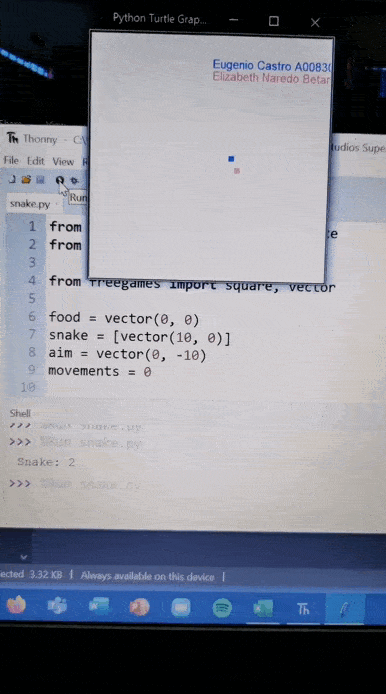

# SemanaTecCompu
Repositorio para mi clase de herramientas computacionales.

- Cada vez que se corra el juego, la víbora y la comida deberán tener colores diferentes entre sí,
pero al azar ()

```python
#declaramos lista
lista_colores = ['black', 'pink', 'blue', 'green', 'yellow', 'orange', 'gray', 'white', 'cyan']
#escoge un color random para snake
color_snake = choice(lista_colores)
#elimina el color de snake para que no se repita
lista_colores.remove(color_snake)
#escoge un color random para food
color_food = choice(lista_colores)
```

En función move()

```python
#dibuja la snake
    for body in snake:
        square(body.x, body.y, 9, color_snake)

#dibuja la food
square(food.x, food.y, 9, color_food)
```
- validar que la comida se mueva cada ciertos movimientos y que no este dentro de snake
```python
 #lista de direcciones
    directions = [(30, 0), (-30, 0), (0, 30), (0, -30)]
    if movements % 5 == 0:
        #escoge una dirección random
        new_direction = choice(directions)
        #se suma a la posición actual
        food.x = food.x + new_direction[0]
        food.y = food.y + new_direction[1]
        # validacion para que la comida no quede dentro de la serpiente.
        while food in snake:
            new_direction = choice(directions)
            #se suma a la posición actual
            food.x = food.x + new_direction[0]
            food.y = food.y + new_direction[1]
```
- volver a agregar info_alumnos
```python
def info_alumnos():
    # agarra el lapiz
    writer.up()
    # se va a esta posicion
    writer.goto(0, 150)
    # escoje el color y lo escribe para cada almuno
    writer.color('blue')
    writer.write('Eugenio Castro A00830392', align='left', font=('Arial', 10, 'normal'))
    # nueva posicion para nuevo nombre
    writer.goto(0, 130)
    writer.color('pink')
    writer.write('Elizabeth Naredo Betancourt A00830440', align='left', font=('Arial', 10, 'normal'))
```
# Gif

